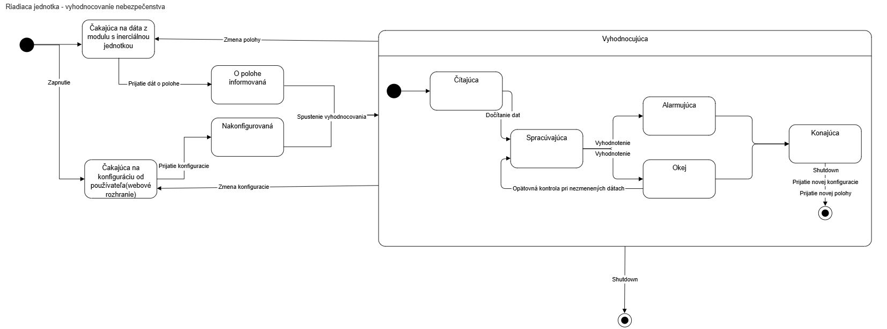
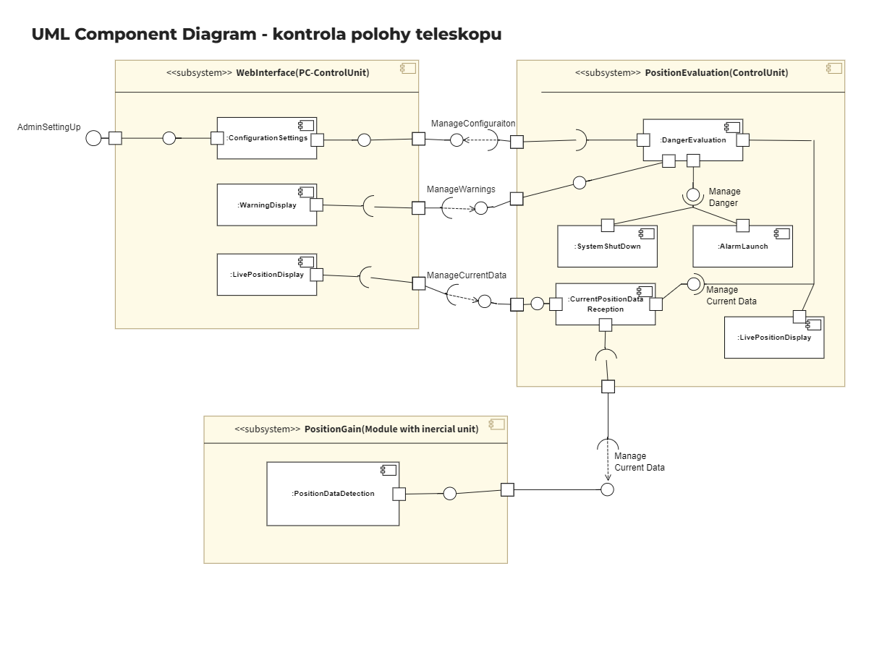
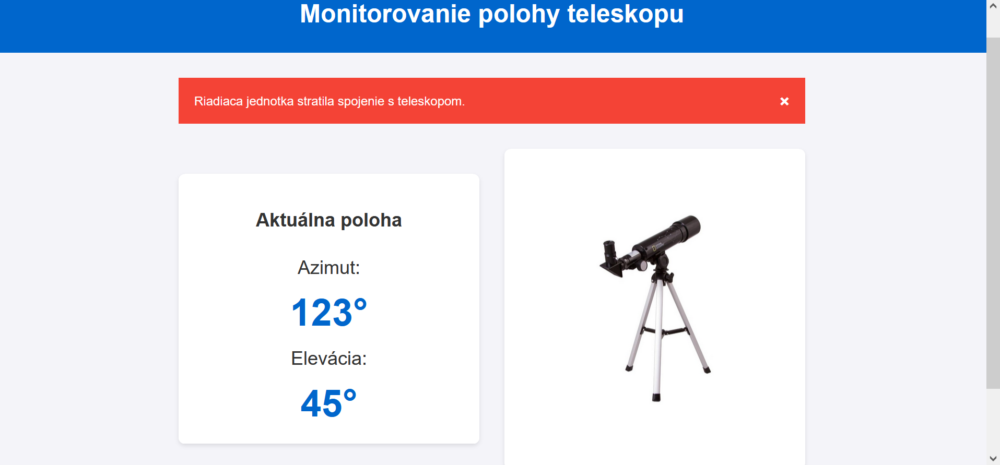
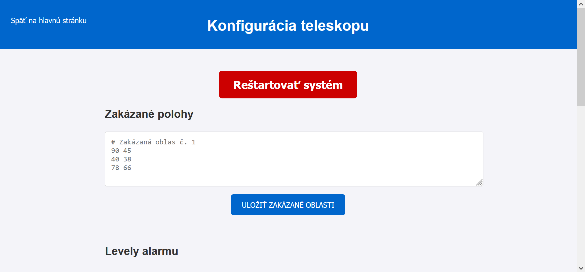
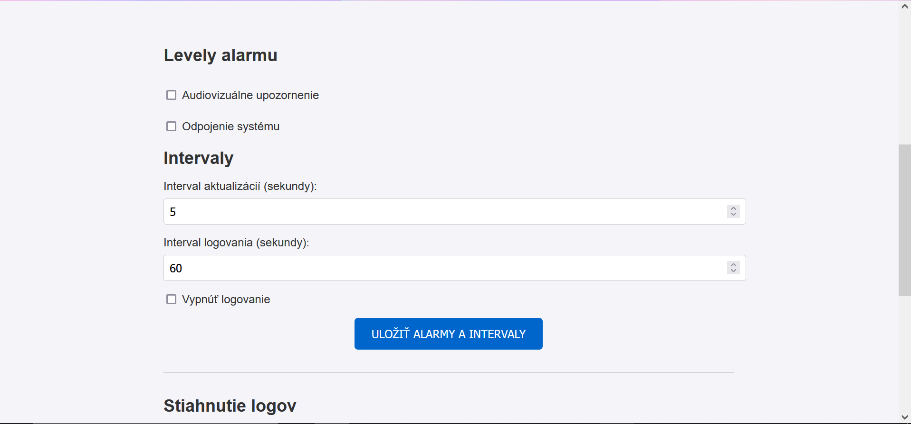

# Návrh 

## Úvod
Tento dokument popisuje návrh pre vývoj systému na monitorovanie a kontrolu polohy teleskopu pre Astronomické a geofyzikálne observatórium Modra-Piesok. Kľúčovými prvkami systému sú modul s inerciálnou jednotkou, riadiaca jednotka a webové rozhranie, ktoré umožňuje vzdialený prístup k údajom a konfigurácii. Tento návrh dokumentuje komunikáciu medzi jednotlivými komponentmi hardvéru a softvéru, špecifikáciu funkcií jednotlivých modulov, podrobnosti o logovaní a správe dát, návrh používateľského rozhrania a plán implementácie.

## Podrobná špecifikácia vonkajších rozhraní systému na kontrolu polohy teleskopu:  

### Definícia komunikácie medzi jednotlivými komponentmi hardvéru (merač/vysielač a prijímač/zobrazovač):

V moduli s inerciálnou jednotkou bude komunikácia medzi senzorom a mikropočítačom prebiehať pomocou I<sup>2</sup>C rozhrania. Modul s inerciálnou jednotkou bude vybavený rádiovým modemom, ktorý zabezpečuje reálnu komunikáciu so systémom riadiacej jednotky. Na komunikáciu mikropočítača s modemom sa využije SPI - Serial Peripheral Interface. Modem bude poskytovať bezdrátovú komunikáciu medzi modulom s inerciálnou jednotkou a riadiacou jednotkou pomocou protokolu LoRa.

Riadiaca jednotka (prijímač/zobrazovač): Má schopnosť prijímať údaje o polohe teleskopu z modulu s inerciálnou jednotkou prostredníctvom rádiového signálu. Obsahuje jednoduchý displej na zobrazenie aktuálnych súradníc azimutu a elevácia. Riadiaca jednotka vie komunikovať s počítačom cez ethernetové rozhranie (Pomocou protokolov HTTP a WebSocket).  

Riadiaca jednotka, po prijatí dát o polohe ďalekohľadu z inerciálnej jednotky rádiovým signálom, zaloguje prijaté dáta do súboru (pre každý deň je vytvorený nový súbor, po určitom čase sa logy automaticky mažú) a odošle dáta vo formáte JSON web klientom pripojeným na WebSocket (na WebSocket sa pripoja pomocou nacitania webu pomocou HTTP a o WS spojenie sa uz postara JS).  

Riadiaca jednotka vyhodnocuje prijaté data (zisťuje, či sa náhodou teleskop nedostal do niektorej zo zakázaných zón). Pokiaľ sa dostal teleskop do zakázanej zóny spustí fyzický alarm (audiovizuálny) a zaloguje spustenie alarmu, aktuálnu polohu, pri ktorej došlo ku kolízii (spusteniu alarmu) a dátum a čas (do špeciálneho logu kolízii, ktoré sa nemažú).  

Prehliadač po prijatí JSON súboru pomocou JavaScript-u JSON rozbalí a zobrazí (optionaly: vykreslí ďalekohľad a jeho aktuálnu polohu).  

Používatelia sa cez prehliadač pripoja na web server cez HTTP[S], obdržia od servera HTML, CSS a JS súbory, následne JavaScript na stránke čaká na prijatie dát cez WebSocket.

## Návrh jednotlivých modulov

### Modul s inerciálnou jednotkou (MIMU):
Inerciálna jednotka umiestnená na teleskope bude monitorovať jeho polohu a pohyb pomocou komponentov Roll-Pitch-Yaw, Eulerových uhlov alebo kvaterniónov. Vstavaný mikropočítač spracováva tieto informácie, preráta ich do uhlov azimut a elevácia. Tieto údaje posiela riadiacej jednotke. V prípade potreby zo strany používateľa dostáva správu od riadiacej jednotky, že modul treba resetnúť a nanovo nakalibrovať.

### Riadiaca jednotka (RJ):
Riadiaca jednotka má ručne vytvorenú MAC adreru, ktora spĺňa špecifikáciu pre takto generovane MAC adresy. Od DHCP servera nasledne získavá IP adresu. K servru sa klienti budu pripajat cez lokalnu adresu something.local (názov domény bude upresnený neskôr) ktorú bude server distribuovať pomocou mDNS protokolu (alternatívne by tento server updatoval svoju lokalnu IP na nejakej dostupnej stránke (najlepšie lokálnej pre menšiu závislosť na sieti), ktorú uživateľ zadá a automaticky ho presmeruje na lokálnu IP RJ).

## Perzistentné údaje (RJ)

### Všeobecné nastavenia:
RJ si pamätá nastavene frekvencie logovania do súboru a frekvencie zasielania Azimutu a Elevácie prihláseným klientom cez WS. 

Tiež si pamätá nastavenia o tom, aké alarmy má spúšťať.

### Log súbory:
Všetku logové súbory sú vo formáte CSV
Priečinok "Positions" obsahuje súbory s logmi. Súbory sa volajú "Log_" + dátum vzniku súboru, t.j. prvého záznamu v ňom. Každý záznam obsahuje timestamp (dátum a čas), polohu Azimut a Eleváciu.

Súbor "Log_collisions" obsahuje informáciu o vstupe teleskopu do zakázaných zón. Záznam obsahuje timestamp, polohu do ktorej vošiel a informáciu o tom, či odpojilo motory (či bolo zapnuté odpájanie motorov).

Súbor "Log_configuration" obsahuje informáciu o každej zmene konfigurácie. Záznam obsahuje timestamp, typ zmeny konfigurácie, IP zariadenia, ktoré menilo toto nastavenie.


### Konfiguračné súbory pre zakázané zóny:
The format of the file is as follows:
```
1. line: Azimuth Elevation
2. line: Azimuth Elevation
3. line: Azimuth Elevation
...
n. line: \n (empty line)
n+1. line: Azimuth Elevation 
...
```

* Azimuth and Elevation are separated by space
* Each Azimuth Elevation is separated by new line
* Each forbidden zone is separated by empty line
* Each forbidden zone contains at least 3 points
* Lines starting with # are ignored


## Diagramy:




## Návrh používateľského rozhrania:







## Plán implementácie:

<b>Modul s inerciálnou jednotkou</b><br>
program v jazyku C vytvorený vo vývojovom prostredí Arduino IDE pre mikropočítač Raspberry Pi Pico 2 na získanie údajov z inerciálnej jednotky 10 DOF IMU Sensor,ICM20948 vo forme Eulerových uhlov, výpočet kvaterniónov, prevod na azimut a eleváciu<br>
program pre vysielač modemu LoRa v jazyku C vytvorený vo vývojovom prostredí Arduino IDE na rádiové zasielanie údajov získaných zo senzoru<br>
program pre prijímač modemu LoRa na prijatie správy ohľadom resetovania a opätovnej kalibrácie modulu

<b>Riadiaca jednotka</b><br>
program v jazyku C vytvorený vo vývojom prostredí Arduino IDE pre spracovanie údajov prijatých u prijímača modemu LoRa<br>
program v jazyku C vytvorený vo vývojom prostredí Arduino IDE pre posielanie správy modulu s inerciálnou jednotkou na jeho opätovnú kalibráciu a resetovanie<br>
program v jazyku C na vyhodnotenie nebezpečenstva podľa získaných a konfiguračných údajov, spúšťanie alarmu, vypnutie systému<br>
program v jazyku C na spracovanie konfiguračného súboru a jeho naparsovanie do dátovej štruktúry

program v jazyku C pre príjem HTTP requestov a distribúciu statických súborov<br>
program v jazyku C pre príjem HTTP POST requestov na konfiguráciu systému<br>
program v jazyku C pre príjem HTTP POST requestov na zipovanie a stiahnutie logovych dat<br>
program v jazyku C pre upgrade HTTP na WebSocket a naslednu distribuciu aktuálnych dát z inerciálnej jednotky

program pre logovanie dát, posielanie na webový server<br>
program na vypísanie dát na displej<br>

<b>Webové rozhranie</b><br>
program v html, css a javascript jazyku pre stránky používateľského rozhrania(konfiguračná stránka, informačná stránka)

## Návrh implementácie:
```cstruct Time{
  int year;
  int month;
  int day;
  int hours;
  int minutes;
  int seconds;
};

struct RollPitchYaw{
    float roll;
    float pitch;
    float yaw;
};

struct AzimuthElevation{
    float azimuth;
    float elevation;
};

struct DegreesMinutesSeconds {
    int degrees;
    int minutes;
    int seconds;
};

enum ChangeType{
    FORBIDDEN_ZONE_CHANGED,
    LOG_FREQUENCY_ALARM_CHANGED,
    RESTRT
};


// Inercialna jednotka

// Reads data from sensor and stores them in RollPitchYaw structure
// @return pointer to RollPitchYaw structure
RollPitchYaw* readFromSensor();

// Converts RollPitchYaw structure to AzimuthElevation structure
// @param rollPitchYaw pointer to RollPitchYaw structure
// @return pointer to AzimuthElevation structure
AzimuthElevation* fromRPYtoAzimuthElevation(RollPitchYaw* rollPitchYaw);

// Sends AzimuthElevation structure to control unit
// @param azimutElevation pointer to AzimuthElevation structure
// @return 0 if success, -1 if error
int sendToControlUnit(AzimuthElevation* azimutElevation);

// Receiving message from control unit to restart
// @return 0 if success, -1 if error
int readFromControlUnit();

// Riadiaca jednotka

// Reads data from inertial unit and stores them in AzimuthElevation structure
// @return pointer to AzimuthElevation structure
AzimuthElevation* readFromInertialUnit();

// Checks if AzimuthElevation structure is in forbidden zone
// @param azimutElevation pointer to AzimuthElevation structure
// @return 0 if not in forbidden zone, -1 if in forbidden zone
int checkForbiddenZone(AzimuthElevation* azimutElevation);

// Sends AzimuthElevation structure to all conected clients via WS
// @param azimutElevation pointer to AzimuthElevation structure
// @return 0 if success, -1 if error
int sendToClients(AzimuthElevation* azimutElevation);

// Dispalays AzimuthElevation structure on screen
// @param azimutElevation pointer to AzimuthElevation structure
// @return 0 if success, -1 if error
void displayAE(AzimuthElevation* azimutElevation);

// Writes AzimuthElevation structure to log file, with timestamp in CSV format
// @param azimutElevation pointer to AzimuthElevation structure
// @return 0 if success, -1 if error
int writeAEtoLog(AzimuthElevation* azimutElevation);

// Checks if file format is correct
// @param newConfiguration from user
// @return 0 if correct, -1 if error
// @note Different error codes can be added
// The format of the file is as follows:
// 1. line: Azimuth Elevation
// 2. line: Azimuth Elevation
// 3. line: Azimuth Elevation
// ...
// n. line: \n (empty line)
// n+1. line: Azimuth Elevation
// ...
// Azimuth and Elevation are separated by space
// Each Azimuth Elevation is separated by new line
// Each forbidden zone is separated by empty line
// Each forbidden zone contains at least 3 points
// Lines starting with # are ignored
int checkFileFormat(const char* newConfiguration);

// Writes new forbidden zones configuration
// @param zones as written by user as const char* type
// @return 0 if success, -1 if error
int writeNewForbiddenConfig(const char* zones);

// Writes new log frequency configuration and alarm settings
// @param data has info on alarm and storing intervals settings
// @return 0 if success, -1 if error
int writeConfigAlarmAndIntervals(const char* data);

// Reads forbidden zones configuration
// stores forbidden zones to global variable "settings.systemForbiddenZones"
// Reads log frequency configuration
// stores log frequency to global variable "settings.log_frequency"
// Reads alarm type configuration
// stores alarm type configuration to global variables "settings.alarm" and "settings.rele"
// Reads logging configuration
// stores logging configuration to global variable "settings.logging"
// Reads update frequency configuration
// stores update frequency configuration to global variable "settings.update_frequency"
// @return 0 if success, -1 if error
int loadSettings();

// Writes change of configuration to log file, with timestamp in CSV format
// @param changeType type of change
// @return 0 if success, -1 if error
int writeChangeToLog(ChangeType changeType);

// Writes in witch position the telescope entered the forbidden zone to log file, with timestamp in CSV format
// @param azimutElevation pointer to AzimuthElevation structure
int writeAlarmToLog(AzimuthElevation* azimutElevation);

// Starts alarm
// @return 0 if success, -1 if error
int startAlarm();

// Stops alarm
// @return 0 if success, -1 if error
int stopAlarm();

// Disables motors
// @return 0 if success, -1 if error
int disableMotors();

// Enables motors
// @return 0 if success, -1 if error
int enableMotors();

// Starts alarm and disables motors
// @return 0 if success, -1 if error
int enteredForbidenZone(AzimuthElevation* azimutElevation);

// Stops alarm and enables motors
// @return 0 if success, -1 if error
int reenable();

// Retrievs real time from Ethernet
// @return time in seconds
Time getRealTime();

// Restarts system
// @return 0 if success, -1 if error
int restart();

// Restarts inertial unit
// @return 0 if success, -1 if error
// @param azimuth value indicates calibration of azimuth on inertial unit
    // if its -1 it stays the same and sensor just resets
int restartInertialUnit(double azimuth = -1);

// Setup HTTP server
// @return 0 if success, -1 if error
int setupHTTPServer();

// Setup WebSocket server
// @return 0 if success, -1 if error
int setupWebSocketServer();

// Setup mDNS server
// @return 0 if success, -1 if error
int setupMDNSServer();

// Starts all servers
// @return 0 if success, -1 if error
int startServers();

// some other functions in mainloop, depending on the libraries used


int enteredForbidenZone(AzimuthElevation* azimutElevation){
    writeAlarmToLog(azimutElevation);
    startAlarm();
    disableMotors();
    return 0;
}

int reenable(){
    stopAlarm();
    enableMotors();
    return 0;
}


```
